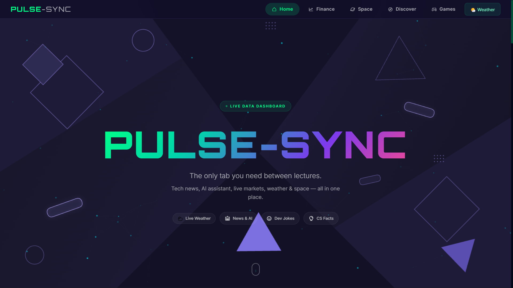
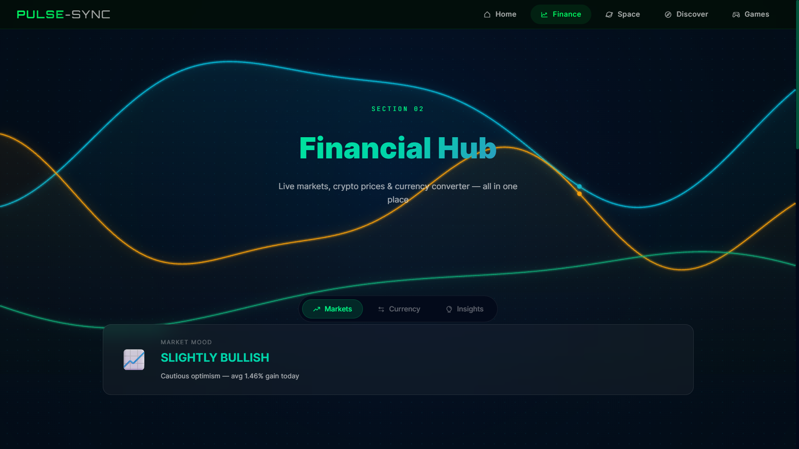
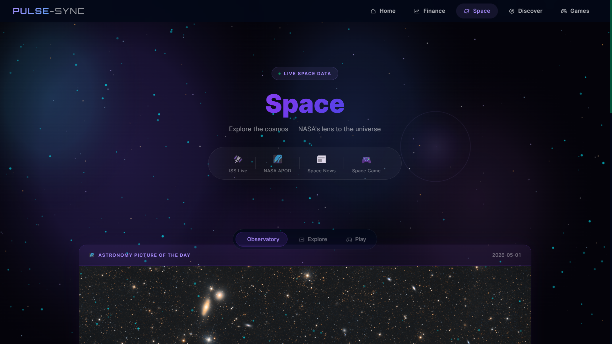
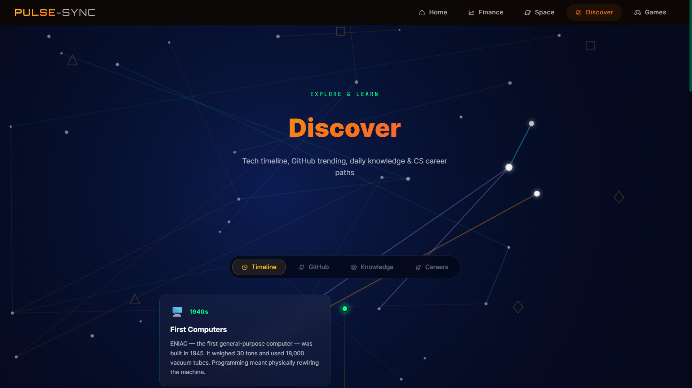
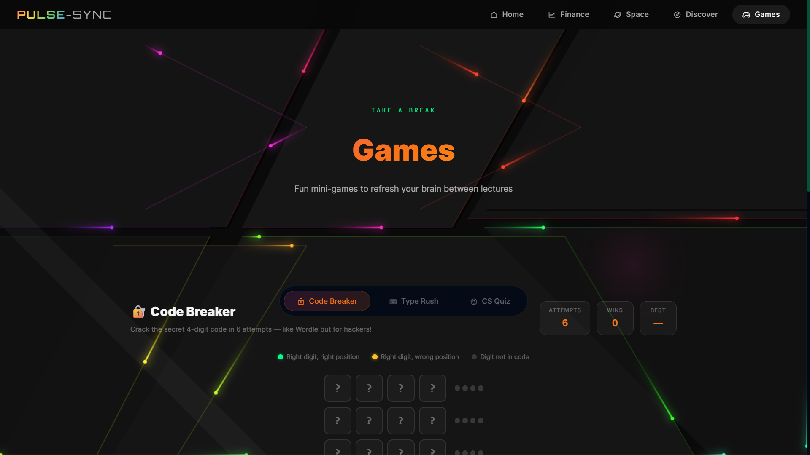

<div align="center">

# ⚡ PULSE-SYNC

### Your Real-Time Data Hub — Built for CS Students

> **"The only tab you need between lectures."**
> Tech news · AI assistant · Live markets · Weather · Space — all in one place.

</div>

---

## 🖥️ Screenshots

| Page            | Preview                                      |
| --------------- | -------------------------------------------- |
| 🏠 **Home**     |          |
| 💰 **Finance**  |    |
| 🔭 **Space**    |    |
| 🧭 **Discover** |  |
| 🎮 **Games**    |        |

---

## 🚀 Live Demo

**[https://pulse-sync-eight.vercel.app/](https://pulse-sync-eight.vercel.app/)**

---

## 📖 About

PULSE-SYNC is a multi-page real-time student dashboard that aggregates live data from 9 public APIs into a single visually immersive interface. Built for CSE students who are tired of switching between 10 different tabs during lectures.

**Built as a 1st Year CSE Project — Group 2G3, Chitkara University, Punjab.**

---

## ✨ Features

### 🏠 Home Page

- **PULSE AI Chatbot** — Powered by Groq (llama-3.1-8b), full conversation history
- **Live Tech News** — Latest tech headlines
- **🌤️ Weather Popup** — Draggable modal, GPS auto-detect, city search
- **Dev Jokes** — Random programming jokes every visit
- **CS Facts** — 15 curated facts, 3 random shown per session
- **Interactive Background** — Geometric parallax shapes that follow cursor

### 💰 Finance Page

- **Live Crypto Markets** — Top 8 coins via CoinGecko (BTC, ETH, SOL...)
- **Currency Converter** — 170+ currencies, live exchange rates
- **Finance Glossary** — Key terms for CS students
- **Animated Background** — Signal graph waves that bend with cursor

### 🔭 Science & Space Page

- **NASA APOD** — Astronomy Picture of the Day with description
- **ISS Live Tracker** — Real-time position, altitude, speed
- **Space News** — Latest exploration headlines
- **Asteroid Dodge Game** — Canvas-based survival game
- **Animated Background** — Deep nebula star field with cursor lens effect

### 🧭 Discover Page

- **GitHub Trending** — What devs are building right now
- **Tech Timeline** — Computing history 1940s to present
- **CS Career Paths** — Top company profiles and interview prep
- **Animated Background** — Constellation nodes with cursor activation

### 🎮 Games Page

- **Code Breaker** — Wordle-style 4-digit code cracker (6 attempts)
- **Type Rush** — Code typing speed test (WPM + accuracy)
- **CS Quiz** — 10-question CS knowledge test with streaks
- **Whack-a-Bug** — CS-themed Whack-a-Mole game
- **Memory Match** — Match the pairs of cards
- **Animated Background** — RGB neon circuit panels, cursor-reactive

---

## 🛠️ Tech Stack

| Category       | Technology                                        |
| -------------- | ------------------------------------------------- |
| **Frontend**   | HTML5, CSS3, Vanilla JavaScript (ES6+)            |
| **Build Tool** | Vite                                              |
| **Deployment** | Vercel                                            |
| **AI**         | Groq API (llama-3.1-8b-instant)                   |
| **Animation**  | HTML5 Canvas API                                  |
| **Styling**    | Custom CSS — Glassmorphism + per-page dark themes |

---

## 🔌 APIs Used

| API                                              | Purpose           | Cost         |
| ------------------------------------------------ | ----------------- | ------------ |
| [Groq](https://groq.com/)                        | AI Chatbot        | Free         |
| [Open-Meteo](https://open-meteo.com/)            | Weather data      | Free, no key |
| [CoinGecko](https://www.coingecko.com/en/api)    | Crypto prices     | Free         |
| [open.er-api](https://www.exchangerate-api.com/) | Currency rates    | Free         |
| [NASA API](https://api.nasa.gov/)                | APOD + Space      | Free key     |
| [Where the ISS At](https://wheretheiss.at/)      | ISS live position | Free, no key |
| [GNews](https://gnews.io/)                       | Tech headlines    | Free tier    |
| [JokeAPI](https://jokeapi.dev/)                  | Programming jokes | Free, no key |
| [Nominatim](https://nominatim.org/)              | Geocoding         | Free, no key |

---

## 📁 Project Structure

```
PULSE-SYNC/
├── index.html              # Home page
├── finance.html            # Financial Hub
├── science.html            # Science & Space
├── discover.html           # Discover
├── games.html              # Games
├── style.css               # Global styles
├── vite.config.js
├── .env                    # API keys (NOT committed)
├── .gitignore
├── assets/
│   └── screenshots/        # Page preview images
└── src/
    ├── main.js             # Home page logic
    ├── finance.js
    ├── science.js
    ├── discover.js
    ├── games.js
    ├── api/
    │   ├── api.js          # All API call functions
    │   └── animations.js   # Shared animation utilities
    └── head-foot/
        ├── navbar.js       # Dynamic navbar component
        └── footer.js
```

---

## ⚙️ Getting Started

### Prerequisites

- Node.js v18+
- npm

### Installation

```bash
# Clone the repo
git clone https://github.com/pranav-pushya/PULSE--SYNC.git
cd PULSE--SYNC

# Install dependencies
npm install
```

Get free keys at:

- Groq → [console.groq.com](https://console.groq.com/)
- NASA → [api.nasa.gov](https://api.nasa.gov/)
- GNews → [gnews.io](https://gnews.io/)

### Run Locally

```bash
npm run dev
# Open http://localhost:5173
```

### Build for Production

```bash
npm run build
```

---

## 🔐 Security

API keys are read from `import.meta.env.VITE_*` environment variables.  
The `.env` file is in `.gitignore` and is never pushed to GitHub.  
For Netlify: add keys via **Site Settings → Environment Variables**.

---

## 👥 Team — Group 2G3

| Role                     | Name             |
| ------------------------ | ---------------- |
| 🧑‍💻 Team Lead & Developer | Pranav Pushya    |
| 🎨 UI Designer           | Shubhangi Savant |

**Institution:** Chitkara University, Punjab  
**Program:** B.Tech CSE (AI/ML) — Semester 2  
**Course:** Frontend Engineering-1 (25CSE0105)

---

## 📄 License

MIT License — free to use, modify, and distribute.

---

<div align="center">

**⚡ Built with passion by Group 2G3 — Chitkara University**

[🌐 Live Site](https://pulse-sync-eight.vercel.app/) · [🐛 Report Bug](https://github.com/pranav-pushya/PULSE--SYNC/issues) · [✨ Request Feature](https://github.com/pranav-pushya/PULSE--SYNC/issues)

</div>
